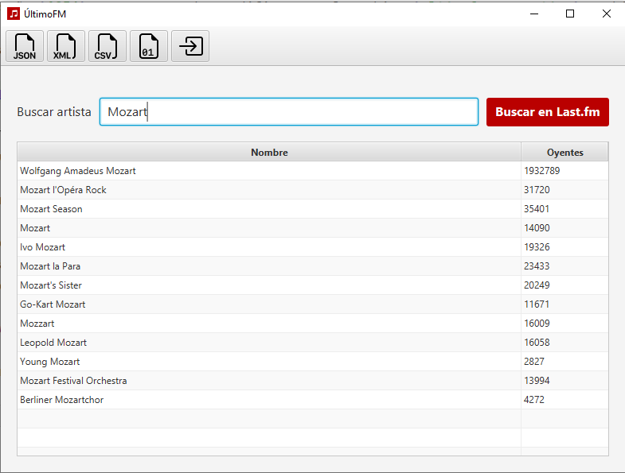
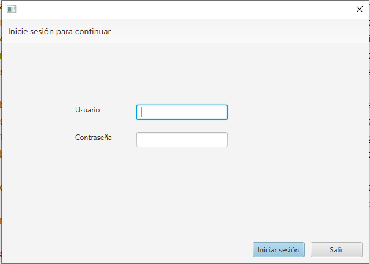
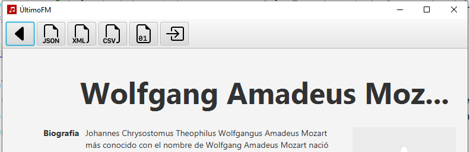
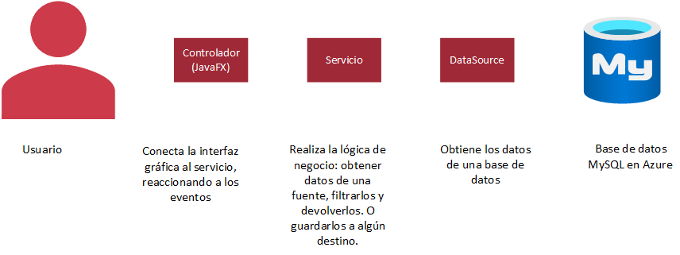

# ÚltimoFM 🎵

Busca la información de tus artistas favoritos!

## Introducción

ÚltimoFM es una aplicación gráfica multiplataforma para buscar información de artistas musicales
empleando
una base de datos relacional. Al iniciar la aplicación, aparece un cuadro de búsqueda para buscar
posibles
coincidencias por su nombre, tras lo que se puede acceder desde la tabla a la página de un artista
individual.

## Manual de usuario 👥

NOTA: Una conexión a Internet será necesaria para ejecutar el programa, salvo que se instale la base
de datos MySQL y los archivos de datos en el equipo local. Para hacer esto, después se debe invocar
el JAR
desde la línea de comandos con las siguientes variables de entorno.

| Variable    | Descripción                                                              | Predeterminado                                                                        |
|-------------|--------------------------------------------------------------------------|---------------------------------------------------------------------------------------|
| DB_URL      | URL de conexión para el servidor MySQL con los datos de artistas         | `jdbc:mysql://dam-aad-ud2.mysql.database.azure.com:3306/proyectoud2_ariel_abel`       |
| DB_USER     | Nombre de usuario de la base de datos de artistas                        | `usuario_artistas`                                                                    |
| DB_PASS     | Contraseña del usuario de la base de datos de artistas                   | `yYTng2wg`                                                                            |
| LOGINDB_URL | URL de la conexión para el servidor MySQL con los usuarios y contraseñas | `jdbc:mysql://dam-aad-ud2.mysql.database.azure.com:3306/proyectoud2_ariel_abel_login` |
| DB_USER     | Nombre de usuario de la base de datos de artistas                        | `usuario_login`                                                                       |
| DB_PASS     | Contraseña del usuario de la base de datos de artistas                   | `7WQzdXsv`                                                                            |

Las credenciales de acceso por defecto son el usuario `admin` y la
contraseña `1234`. Tras introducir las credenciales correctas, se muestra una
interfaz donde se puede escribir el nombre del artista que se desea consultar.

Al realizar la búsqueda, el programa propondrá una lista de artistas con base en las coincidencias
encontradas. Si se pulsa uno de los cuatro botones de la parte superior guardará esa lista de
artistas en un archivo, dependiendo del botón que se pulse. El primer botón guarda como JSON, el
segundo, como XML, el siguiente en texto plano CSV y, por último, como un objeto binario de Java.
Finalmente, existe un botón para cerrar el programa y otro para insertar un nuevo artista.

Al seleccionar cualquiera de estos artistas se pasará a una ventana donde se muestra de forma
pormenorizada la información del artista; así como un botón para volver al buscador. El resto de
botones sirven para lo mismo que antes esta vez guardando la información concreta del artista
seleccionado.

## Manual de desarrollador 🛠

Este programa se trata de una aplicación JavaFX con Gradle, dentro del módulo 'app'. El
archivo `module-info.java`
dentro del main contiene el módulo de Java con las distintas exportaciones y requisitos de paquetes.
Entrando al paquete
`com.github.cgainstitution.proyectoud1arielabel.app` encontramos una primera
clase `Main` que se encarga de
arrancar la aplicación JavaFX `UltimoFMApplication` y la interfaz gráfica
en FXML.

El paquete `controller` incluye el controlador de cada "pantalla" de la aplicación: la pantalla
principal `MainWindowController` y la página de datos del artista `ArtistDataWindowController`,
además de las de los diálogos `DialogoLogin` y `DialogoCrear`.

En `service`, se contiene la capa de servicio donde se realiza la "lógica de negocio", es decir,
hacer llamadas a la base de datos, validaciones, guardar objetos a archivos...

Dentro de `datasource` se realizan las llamadas a la base de datos de artistas, con sus
corrrespondientes consultas y recuperando a los modelos en `models`.

Por último, los `models` son `record` de Java 14 que contienen los datos de los artistas que
recupera de la base de datos. ResumenArtista contiene los datos básicos de un artista (para un
resultado de búsqueda) y Artista contiene todos los datos de un artista.

Para entender mejor los componentes de la arquitectura de este programa, el siguiente diagrama (
elaboración propia)
puede ser de ayuda:

## Reparto de tareas 📋

_Nota: A partir del trabajo de la UD1_

El esquema y dataset de la base de datos se ha realizado por Ariel. La implementación de las nuevas
partes de la aplicación (interfaz gráfica, controladores, servicios...) se ha realizado por Abel,
con ayuda puntual de Ariel. La documentación se ha redactado por ambos. El diagrama de la
arquitectura fue creado por Ariel. La seguridad fue implementada por Ariel, con ayuda de Abel
revisando el código por posibles vulnerabilidades. Finalmente, la base de datos en Azure fue
desplegada por Abel, con la ayuda de Ariel para configurar el servidor.

## Extras

Se realizaron los siguientes extras en el Proyecto:

- Ordenación de resultados de las consultas y almacenaje de los datos (mediante la tabla de JavaFX).
- Control de errores (errores de ficheros, consultas sin resultados...)
- Adición de un login (control de acceso restringido) con usuario y contraseña contenidos en una
  base de datos distinta. Ver [SEGURIDAD.md](SEGURIDAD.md) para más información.

## Propuestas

- Mejoras a la interfaz gráfica, o uso de una hoja de estilos distinta (AtlantaFX, BootstrapFX...)

## Otros créditos

Los siguientes proyectos y herramientas fueron útiles en la realización de este proyecto:

- [mvnrepository.com](https://mvnrepository.com/): Encontrar dependencias útiles para el proyecto
- [Bootstrap Icons](https://icons.getbootstrap.com/): Iconos en la aplicación (Licencia MIT)
- JetBrains Code with Me: Codificación en pareja de forma remota
- [Javadoc de JavaFX 8](https://docs.oracle.com/javase/8/javafx/) Documentación de JavaFX para Java
  8 de Oracle
- [Comunidad de JavaFX en Reddit](https://www.reddit.com/r/javafx/) Ayuda para generar un JAR
  multiplataforma con JavaFX desde Maven.
- [Microsoft Azure](https://azure.microsoft.com/es-es/) Proveer crédito educativo para el uso de
  servicios de Azure, en este caso, el servidor MySQL.

## Conclusiones

Abel: Este proyecto ha sido una buena oportunidad para aprender a usar más JavaFX que fue un apartado
que no había tocado en profundidad en el anterior proyecto. Además, ha sido una buena oportunidad para
conocer más sobre la seguridad en aplicaciones Java, y cómo implementarla de forma sencilla.

Ariel: Este trabajo fue bastante más sencillo de lo que esperaba, ya que Abel se manejaba mejor por el
código y con Git, además de que pude hacer bastante limpieza, reduciendo la complejidad del código y
eliminando código innecesario.

En total le he dedicado unas 5 horas de clase, principalmente explicando cosas que pueden ser complejas a Abel, y
haciendo pruebas de concepto para ver si funcionaba lo que queríamos hacer. Además de corrigiendo fallos y diseñando
las nuevas funcionalidades (login contra base de datos, inserción y eliminación de artistas).